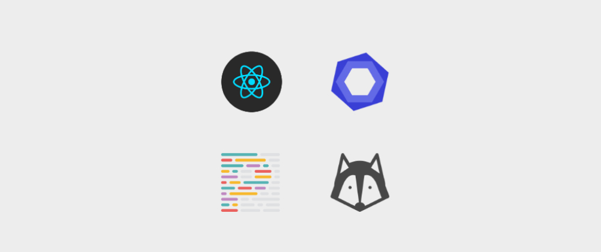

### Preview app: [example-blog](https://example-blog-seven.vercel.app/)
### ESLint, Prettier e GitHooks com Husky em React.js
Aprenda a validar seu código antes do commit no Git usando GitHooks com Husky, ESLint e Prettier em projetos React.js

 

